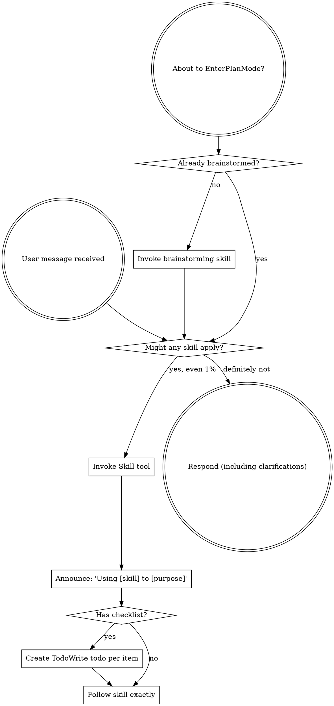

Reading additional input from stdin...
OpenAI Codex v0.128.0 (research preview)
--------
workdir: /Users/murchewings/Projects/journal/v2
model: gpt-5.5
provider: openai
approval: never
sandbox: read-only
reasoning effort: high
reasoning summaries: none
session id: 019e3771-420e-7471-bc1b-cc0e1bd956e3
--------
user
Adversarial plan review. Murch wants beautiful HTML 'summer book report' of 3-month builder sabbatical, hosted on Vercel. Prior dashboards were janky. Tell me: 1) Highest-risk steps. 2) What's missing in plan. 3) Design pitfalls. 4) Whether the 10-iteration RWL structure is right. Be concrete, under 500 words.

<stdin>
# Summer Book Report — Builder Sabbatical (Feb 8 – May 17, 2026)

**Author:** Claude Opus 4.7 (ClawMac)
**Started:** 2026-05-17
**Loop budget:** 10 RWL iterations; ≥90 min runtime
**Live target:** Vercel deploy, public link Murch can share

---

## North Star

A **summer book report** for Murch's 3-month Builder Sabbatical: celebratory but honest, dense with learnings/inventions, beautifully designed (editorial, not dashboard), reconciled against Airtable as canonical, and **published live**.

Prior artifacts (`journal/sabbatical-dashboard.html`, `builder-sabbatical-inventory.html`, `projects-inventory.html`) only cover Feb 8 → Mar 8 (29 days). This v2 covers the full **Feb 8 → May 17 (~99 days)** arc. Treat prior as scaffolding, not gospel — opus-review.md already flagged data discrepancies (257.6 vs 576.9 work hours, etc.).

---

## Decomposition

### Phase 0 — Plan + Validate (Iter 1–2)
- [x] Inventory prior artifacts
- [x] Set up `journal/v2/` workspace
- [ ] Write PLAN.md (this file)
- [ ] Dispatch plan to Gemini-CLI + Codex-CLI in parallel for adversarial review
- [ ] Refine plan based on critique

### Phase 1 — Fact Gathering (Iter 2–3)
**Canonical sources to pull:**
- `business-ideas/TRACKER.md` (~73 ideas) + Airtable `appXq9zG3Gs5IiR3r` (~93 records per memory) — verify counts, resolve drift
- `claude-workflows/repo-location-matrix.md` — repos per machine
- `claude-workflows/tool-connectivity-matrix.md` — 40+ tools, 65 integrations
- `claude-workflows/TOKEN-INVENTORY.md` + Airtable Token Dashboard (73 services, 10 tables) — subscriptions/spend
- `claude-workflows/openclaw-instance-registry.md` — squad topology
- `journal/openclaw-daily-work-log.md` (393KB) — Feb-Mar narrative substrate
- `journal/openclaw-key-work-items.md` — sabbatical milestones
- `journal/sabbatical-opus-review.md` — honest accounting (data discrepancies, abandoned projects)
- `journal/builder-sabbatical-recap-2026-02.md` (83KB) — daily diary Feb 8–Mar 8
- Memory files in `~/.claude/projects/-Users-murchewings-Projects/memory/`
- Git logs across all active repos (Feb 8 → May 17)

**Coverage extensions (Mar 8 → May 17):**
- Caddy + RefClaw orchestration (2026-04-09)
- Peer-Approval Protocol rollout (2026-05-16)
- Qdrant migrations (2026-05-14, 2026-05-15)
- TokenRouter OpenClaw rollout (2026-05-04)
- Tangent Expo retirement (2026-05-10)
- Recent business-ideas additions (#73-92+)

### Phase 2 — Concept Mining (Iter 3)
**Use `/embedding-search` + grep for novel concepts** — both adopted and invented:

**Concepts I learned (adopted from others):**
- Agentic patterns (RAMS, Mem0, peer governance)
- Exec approval protocols
- Diverge-converge corpus methodology
- TokenRouter prepaid-pool strategy
- Cross-machine sync (Tailscale)
- LLM-as-judge frameworks

**Concepts I invented/explored (mine to claim):**
- Voice training from "exhaust" — recycling throwaway recordings
- PS5 controller programming (keyboard-free workflow)
- Peer-approval mesh (agent-to-agent exec approvals)
- Caddy as router + token FinOps
- RAMS training pipeline from postmortems
- Multi-agent ecology w/ named identities (squad-as-organism)
- ClawLee "soul" — agent identity files

**Programs/tools mastered:**
- Claude Code (Opus 4.6 → 4.7 migration)
- TokenRouter, OpenRouter, Anthropic API
- Airtable + MCP
- Linear + cron
- Qdrant (embeddings infra)
- Tailscale (mesh networking)
- Hostinger VPS + Docker (ClawLee container)
- Vercel + Next.js
- SuperWhisper (voice → text pipeline)
- Mem0
- Cursor, Codex CLI, Gemini CLI, Aider, Goose, OpenCode
- Playwright (browser automation)
- Capacitor (PWA → native wrapper)
- n8n (workflow automation, dormant)
- Semgrep, Snyk (security)

### Phase 3 — Reconciliation (Iter 4)
- Compare counts across Airtable / TRACKER.md / filesystem
- Document drift; patch bi-directionally where safe
- Establish "canonical-as-of-2026-05-17" snapshot for the report

### Phase 4 — Content Authoring (Iter 4–5)
Markdown-first in `src/content.md`. Sections:

1. **Hero / Prologue** — the arc of 3 months, opening hook
2. **By the Numbers** — corrected stats with caveats (don't repeat the 257.6 vs 577 hours confusion; pick one canonical methodology)
3. **The Squad** — agents as cast of characters (ClawMac, ClawWin, ClawLee, KakeyClaw, Caddy, RefClaw, Rosie, ClawDad)
4. **Products I Shipped (or Almost Shipped)** — Tangent, Naggler, Career Mode AI, Lume/Tender, Promptrait, ES Scalper, Caddy/RefClaw, Business Ideas portfolio
5. **Concepts I Learned** — what's already in the world
6. **Concepts I Invented or Explored** — voice exhaust, PS5 controller, peer-approval mesh, etc.
7. **Tools in the Stack** — 40+ tools, the ladder strategy, TokenRouter
8. **Honest Accounting** — what didn't ship, $0 revenue, the documentation:code ratio, abandoned repos
9. **Skills Developed** — squad orchestration, embeddings pipelines, exec governance, cross-machine sync, agent design
10. **What's Next** — going back to Visa, what changes, the kept ideas

### Phase 5 — Design (Iter 5–6)
**Reject the v1 aesthetic:** generic GitHub-dark `#0d1117` dashboard with sloppy stat-card spacing.

**v2 aesthetic — Editorial, not dashboard:**
- Type: serif (Fraunces, Libre Caslon, or PP Editorial New) for display + headings; sans (Inter, IBM Plex Sans) for body; mono (JetBrains Mono, Berkeley Mono) for stats/code
- Palette: warm paper (#FAF6EE) + ink (#1A1816) + accent ochre (#B8743A) + sage (#7A8B6D) — or cool inverse for dark sections. **Test both.** Hand-painted feel.
- Layout: vertical, magazine-style. Cinematic margins. Drop caps. Pull quotes. Numbered chapters.
- Charts: hand-tuned SVG, no Chart.js default themes. Tasteful.
- Motion: subtle scroll reveals only. No parallax junk.
- Mobile: fluid type (clamp), 1-column collapse.
- Print-friendly stylesheet (it's a "book" report).

### Phase 6 — Adversarial Review (Iter 6–7)
Dispatch (parallel where possible):
- **Codex CLI** — code review of HTML/CSS, accessibility, semantic structure
- **Gemini CLI** — design critique, copy critique
- **Aider + TokenRouter (DeepSeek)** — adversarial content review (is anything overclaimed?)
- **Factory Droid (Linear)** — long-running review with comments
Capture critiques in `validation/`, iterate.

### Phase 7 — Visual QA (Iter 7–8)
- Playwright headless screenshots: 1440×900, 1024×768, 390×844 (iPhone)
- Lighthouse (perf/a11y/SEO)
- Color contrast (WCAG AA minimum)
- Print preview test

### Phase 8 — Deploy (Iter 8)
- `vercel` from `journal/v2/deploy/`
- Custom subdomain if quick (or default `*.vercel.app`)
- Verify live URL renders identically to local

### Phase 9 — Polish + Final QA (Iter 9–10)
- Address any remaining adversarial feedback
- Bi-directional Airtable patches where the report surfaced drift
- Final pass on copy
- `ShipIt!` only when truly complete

---

## Definition of Done

A `ShipIt!` requires ALL of:
1. Live Vercel URL loads, mobile + desktop pass
2. Counts in HTML match Airtable + TRACKER.md (or drift is documented)
3. At least 3 adversarial reviews captured + addressed
4. Copy covers all 10 sections above
5. Both "concepts learned" and "concepts invented" sections have ≥5 entries each, with examples
6. Honest accounting section is present (no whitewashing)
7. Visual QA screenshots saved
8. Plan and execution log in `journal/v2/`

---

## Risks + Mitigations

| Risk | Mitigation |
|---|---|
| Data drift kills credibility | Pick one canonical hours methodology; cite caveat once, prominently |
| Design feels generic | Reject default Tailwind/Bootstrap; hand-roll CSS; show drafts to Gemini |
| Scope creep — too much data, narrative drowns | Hard cap: 10 sections, ~4000–6000 words |
| Vercel deploy auth blocks | Pre-check vercel login state in Iter 7 |
| Sub-agent dispatch fails | Have grep/Read fallback; don't block on external models |
| Counts can't be reconciled | Document the discrepancy in the report itself (transparency > pretense) |
</stdin>
codex
Using `superpowers:using-superpowers` briefly because its trigger applies at conversation start; then I’ll keep the review tight and concrete.
exec
/bin/zsh -lc "sed -n '1,180p' /Users/murchewings/.codex/plugins/cache/openai-curated/superpowers/dc902811/skills/using-superpowers/SKILL.md" in /Users/murchewings/Projects/journal/v2
 succeeded in 0ms:
---
name: using-superpowers
description: Use when starting any conversation - establishes how to find and use skills, requiring Skill tool invocation before ANY response including clarifying questions
---

<SUBAGENT-STOP>
If you were dispatched as a subagent to execute a specific task, skip this skill.
</SUBAGENT-STOP>

<EXTREMELY-IMPORTANT>
If you think there is even a 1% chance a skill might apply to what you are doing, you ABSOLUTELY MUST invoke the skill.

IF A SKILL APPLIES TO YOUR TASK, YOU DO NOT HAVE A CHOICE. YOU MUST USE IT.

This is not negotiable. This is not optional. You cannot rationalize your way out of this.
</EXTREMELY-IMPORTANT>

## Instruction Priority

Superpowers skills override default system prompt behavior, but **user instructions always take precedence**:

1. **User's explicit instructions** (CLAUDE.md, GEMINI.md, AGENTS.md, direct requests) — highest priority
2. **Superpowers skills** — override default system behavior where they conflict
3. **Default system prompt** — lowest priority

If CLAUDE.md, GEMINI.md, or AGENTS.md says "don't use TDD" and a skill says "always use TDD," follow the user's instructions. The user is in control.

## How to Access Skills

**In Claude Code:** Use the `Skill` tool. When you invoke a skill, its content is loaded and presented to you—follow it directly. Never use the Read tool on skill files.

**In Copilot CLI:** Use the `skill` tool. Skills are auto-discovered from installed plugins. The `skill` tool works the same as Claude Code's `Skill` tool.

**In Gemini CLI:** Skills activate via the `activate_skill` tool. Gemini loads skill metadata at session start and activates the full content on demand.

**In other environments:** Check your platform's documentation for how skills are loaded.

## Platform Adaptation

Skills use Claude Code tool names. Non-CC platforms: see `references/copilot-tools.md` (Copilot CLI), `references/codex-tools.md` (Codex) for tool equivalents. Gemini CLI users get the tool mapping loaded automatically via GEMINI.md.

# Using Skills

## The Rule

**Invoke relevant or requested skills BEFORE any response or action.** Even a 1% chance a skill might apply means that you should invoke the skill to check. If an invoked skill turns out to be wrong for the situation, you don't need to use it.

## Red Flags

These thoughts mean STOP—you're rationalizing:

| Thought | Reality |
|---------|---------|
| "This is just a simple question" | Questions are tasks. Check for skills. |
| "I need more context first" | Skill check comes BEFORE clarifying questions. |
| "Let me explore the codebase first" | Skills tell you HOW to explore. Check first. |
| "I can check git/files quickly" | Files lack conversation context. Check for skills. |
| "Let me gather information first" | Skills tell you HOW to gather information. |
| "This doesn't need a formal skill" | If a skill exists, use it. |
| "I remember this skill" | Skills evolve. Read current version. |
| "This doesn't count as a task" | Action = task. Check for skills. |
| "The skill is overkill" | Simple things become complex. Use it. |
| "I'll just do this one thing first" | Check BEFORE doing anything. |
| "This feels productive" | Undisciplined action wastes time. Skills prevent this. |
| "I know what that means" | Knowing the concept ≠ using the skill. Invoke it. |

## Skill Priority

When multiple skills could apply, use this order:

1. **Process skills first** (brainstorming, debugging) - these determine HOW to approach the task
2. **Implementation skills second** (frontend-design, mcp-builder) - these guide execution

"Let's build X" → brainstorming first, then implementation skills.
"Fix this bug" → debugging first, then domain-specific skills.

## Skill Types

**Rigid** (TDD, debugging): Follow exactly. Don't adapt away discipline.

**Flexible** (patterns): Adapt principles to context.

The skill itself tells you which.

## User Instructions

Instructions say WHAT, not HOW. "Add X" or "Fix Y" doesn't mean skip workflows.

codex
**1. Highest-Risk Steps**

The biggest risk is **Phase 1–3 data reconciliation**. You have too many sources, many are stale, and the plan says “Airtable canonical” while also promising bi-directional patches. That can easily consume the whole loop and still leave uncertainty. Freeze a snapshot; do not try to repair the world.

Second risk: **Git logs across all active repos**. That is unbounded. Limit to named repos and extract only headline commits, not full archaeology.

Third: **Phase 6 adversarial review sprawl**. Four external reviewers plus iteration is too much for a report site. Require one content adversary and one visual/code reviewer; treat others as optional.

Fourth: **Vercel auth/deploy too late**. Pre-check in Iter 1, not Iter 7. Deployment failure at the end is fatal.

**2. What’s Missing**

No clear **audience definition**. Is this for Murch privately, friends, future collaborators, Visa coworkers, or public internet? That changes honesty, tone, names, spend, screenshots, and sensitive infra details.

No **privacy/security pass**. You mention tokens, machine topology, Tailscale, Hostinger, Caddy, agent names, Linear, Airtable IDs. Public report needs redaction rules.

No **source citation model**. For credibility, every number should have a source label: Airtable, TRACKER, git, diary, estimate.

No **editorial spine**. Ten sections are topics, not a story. The page needs a thesis: “I spent 99 days turning myself into an agent-orchestration lab, shipped less product than hoped, but built a durable operating system.”

No **asset plan**. Beautiful editorial HTML needs images, diagrams, timelines, portraits, repo constellation, tool map, or artifacts. Typography alone will not save it.

**3. Design Pitfalls**

Warm paper + serif + ochre/sage can become fake-literary Substack quickly. Avoid nostalgia cosplay. Use the aesthetic to support dense technical material, not to hide it.

“Hand-painted feel” is dangerous unless executed well. Bad faux-handmade charts look amateur. Prefer precise editorial diagrams with a few human touches.

Do not overuse stat cards. Prior dashboards were janky partly because the artifact shape was wrong. Use chapter openers, margin notes, timelines, annotated inventories, and one strong systems map.

Do not make the squad section too cute. Agent identities can be charming, but public readers need operational meaning: role, machine, capability, failure mode.

**4. Is 10-Iteration RWL Right?**

Structurally yes, but the allocation is wrong. Too much review, too late deploy, too much reconciliation.

Better split:

1. Deploy skeleton immediately.
2. Freeze sources and redaction rules.
3. Build narrative outline.
4. Create visual system.
5. Draft content.
6. Add diagrams/stats.
7. Mobile/print QA.
8. Content adversarial review.
9. Visual/code review.
10. Final deploy verification.

Make “canonical enough” the standard. The report succeeds if it is beautiful, honest, sourced, and live. It fails if it becomes an unfinished reconciliation project.
tokens used
21,798
**1. Highest-Risk Steps**

The biggest risk is **Phase 1–3 data reconciliation**. You have too many sources, many are stale, and the plan says “Airtable canonical” while also promising bi-directional patches. That can easily consume the whole loop and still leave uncertainty. Freeze a snapshot; do not try to repair the world.

Second risk: **Git logs across all active repos**. That is unbounded. Limit to named repos and extract only headline commits, not full archaeology.

Third: **Phase 6 adversarial review sprawl**. Four external reviewers plus iteration is too much for a report site. Require one content adversary and one visual/code reviewer; treat others as optional.

Fourth: **Vercel auth/deploy too late**. Pre-check in Iter 1, not Iter 7. Deployment failure at the end is fatal.

**2. What’s Missing**

No clear **audience definition**. Is this for Murch privately, friends, future collaborators, Visa coworkers, or public internet? That changes honesty, tone, names, spend, screenshots, and sensitive infra details.

No **privacy/security pass**. You mention tokens, machine topology, Tailscale, Hostinger, Caddy, agent names, Linear, Airtable IDs. Public report needs redaction rules.

No **source citation model**. For credibility, every number should have a source label: Airtable, TRACKER, git, diary, estimate.

No **editorial spine**. Ten sections are topics, not a story. The page needs a thesis: “I spent 99 days turning myself into an agent-orchestration lab, shipped less product than hoped, but built a durable operating system.”

No **asset plan**. Beautiful editorial HTML needs images, diagrams, timelines, portraits, repo constellation, tool map, or artifacts. Typography alone will not save it.

**3. Design Pitfalls**

Warm paper + serif + ochre/sage can become fake-literary Substack quickly. Avoid nostalgia cosplay. Use the aesthetic to support dense technical material, not to hide it.

“Hand-painted feel” is dangerous unless executed well. Bad faux-handmade charts look amateur. Prefer precise editorial diagrams with a few human touches.

Do not overuse stat cards. Prior dashboards were janky partly because the artifact shape was wrong. Use chapter openers, margin notes, timelines, annotated inventories, and one strong systems map.

Do not make the squad section too cute. Agent identities can be charming, but public readers need operational meaning: role, machine, capability, failure mode.

**4. Is 10-Iteration RWL Right?**

Structurally yes, but the allocation is wrong. Too much review, too late deploy, too much reconciliation.

Better split:

1. Deploy skeleton immediately.
2. Freeze sources and redaction rules.
3. Build narrative outline.
4. Create visual system.
5. Draft content.
6. Add diagrams/stats.
7. Mobile/print QA.
8. Content adversarial review.
9. Visual/code review.
10. Final deploy verification.

Make “canonical enough” the standard. The report succeeds if it is beautiful, honest, sourced, and live. It fails if it becomes an unfinished reconciliation project.
